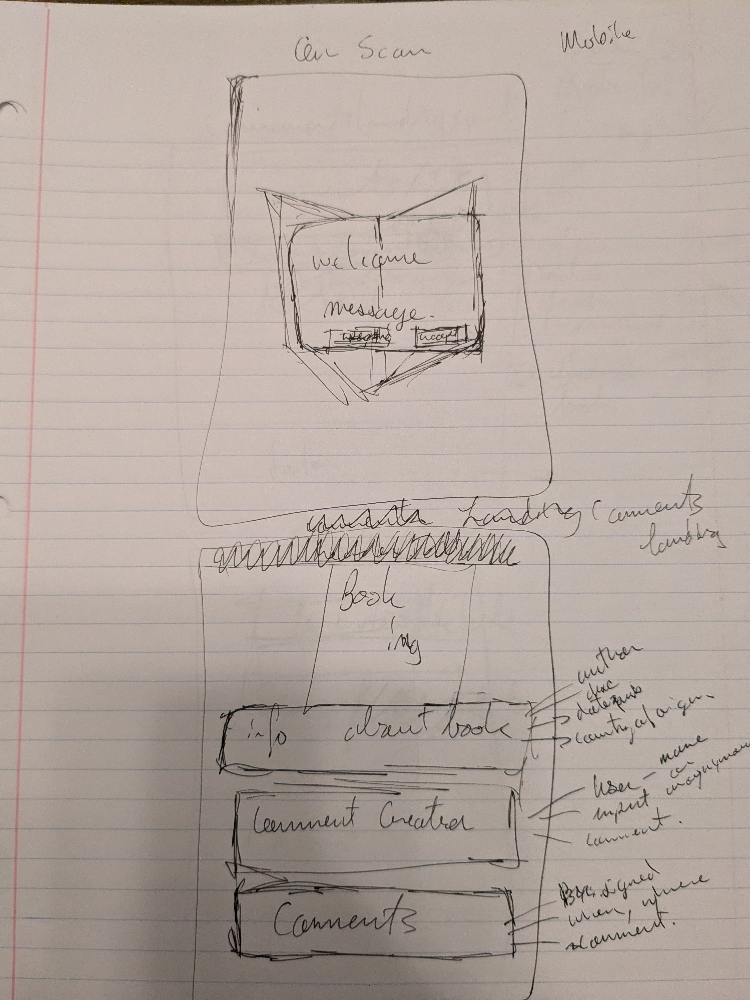
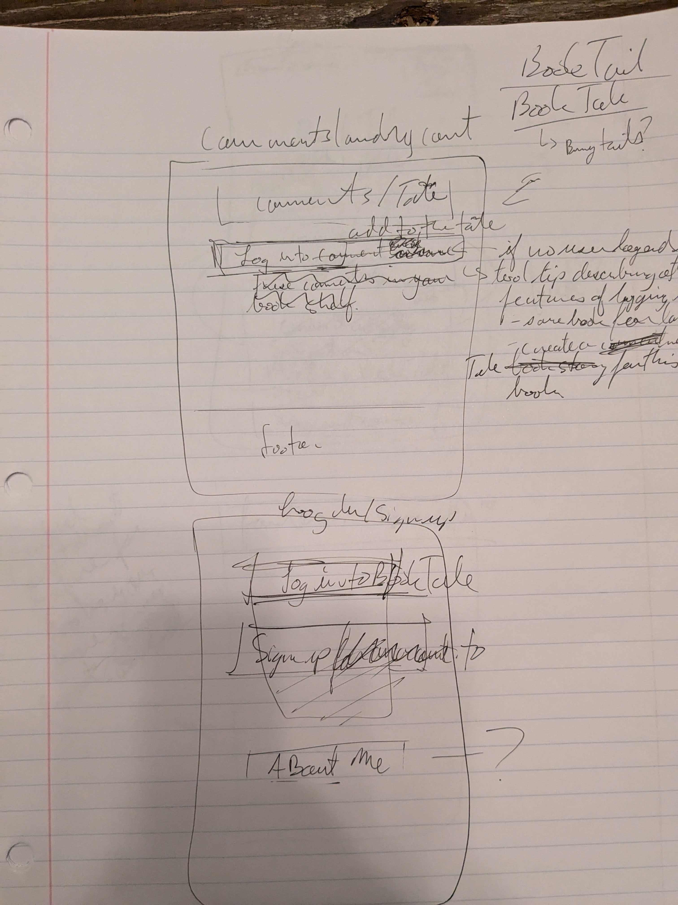
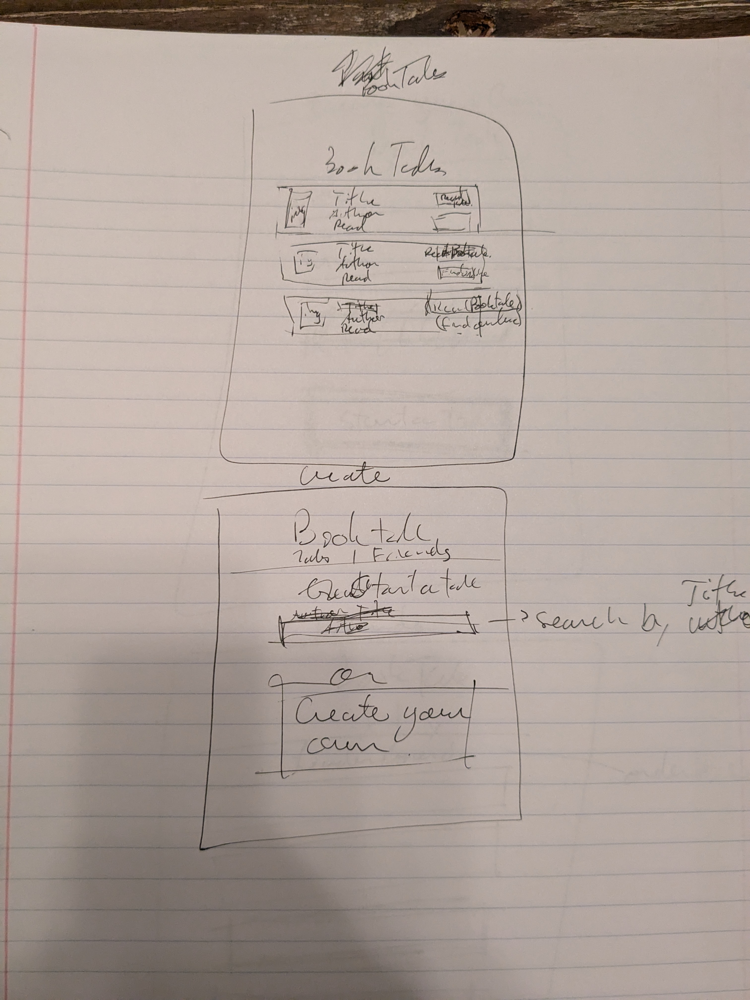
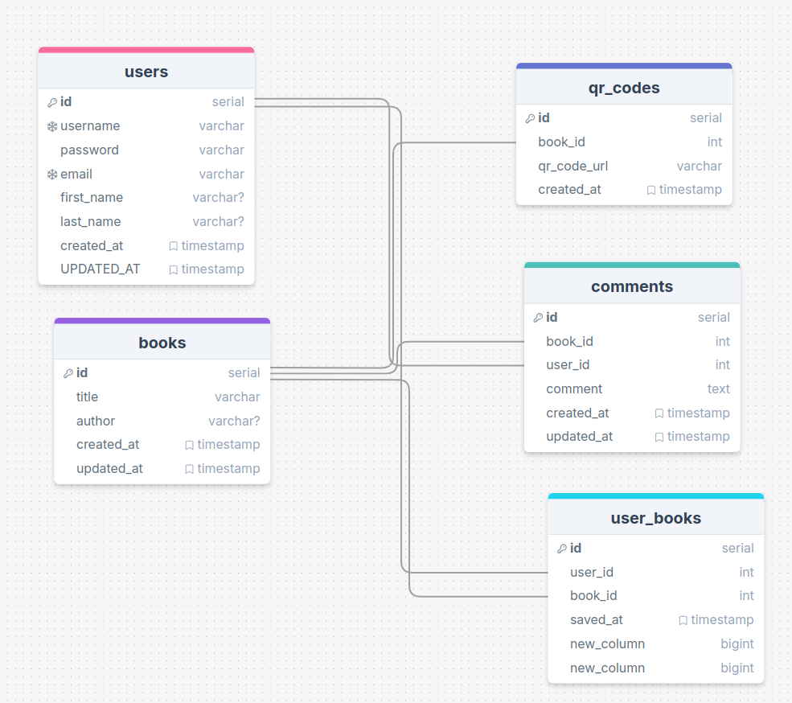

# Booktale

Deployed at [Booktale](booktale.netlify.app)

### How To Build

#### Install dependencies
npm install

#### Start development server
npm run dev

#### Build the application for production
npm run build

## Overview

This app uses qr codes to create exclusive comment sections for individual books. It includes user authentication and book and comment saving. 

### Problem Space

This app allows users to see where books have been, what past contributors thought about it, and future locaitons and thoughts about a text after they give it away.

### User Profile

Travelers and used book enthusiasts alike. My initial idea for this app came from my experience traveling and swapping books in hostels and used book stores. When I pick up a used book I wonder about the story of it's past and I want to know how a book I have relinquished has affected its future readers. 

### Features

- user account create/login with past books and comments saved 
- user home page displaying recent activity of past books;
- user can create a new qr for a book
- ability to scan a qr code
- user can see and set comments on a book qr they scan
- user can see past books, and new comments on past books
- book recommendations based on like genre (potential advertisement opportunity)

## Implementation

### Tech Stack

HTML, scss, JavaScript, React, Psql, Node.js, Express.

Client side: react, react router, axios, html5-qrcode, qrcode-decoder-js, psql

ServerSide: knex, uuid, qrcode, scrypt

### APIs

- Uses Open Library API to search books and display book information.

### Sitemap

- comments - anyone who scans can see the comments
- Log in or create account - if user wants to save books and comment
- create a new BookTale qr page 
- past books page - users can see their past books and comments, and update comment sections for the books in their past. Potential to allow user to borrow a digital copy of a past book or purchase a new copy.

### Mockups

### landing page

### homepage

### comments/login/signup

### tales/createTales

### Data

### Endpoints

GET books data from API

GET user data, comment data, qrcode data, from server

POST user data, comment data, qrcode data, to server

PUT user data

## Roadmap

Sprint 1 - qr code to comment section, db migrate and seed, log in UX for comments, create a BookTale

Sprint 2 - connect to api to display book data, save users comments and books scanned, homepage and display books with new comments

Sprint 3 -  style for all sizes - deploy

---

## Future Implementations

- connect to google books api to use google to authenticate users. 
- ability to put up books for trade with other users. 
- track friends booktale progress (follow)
